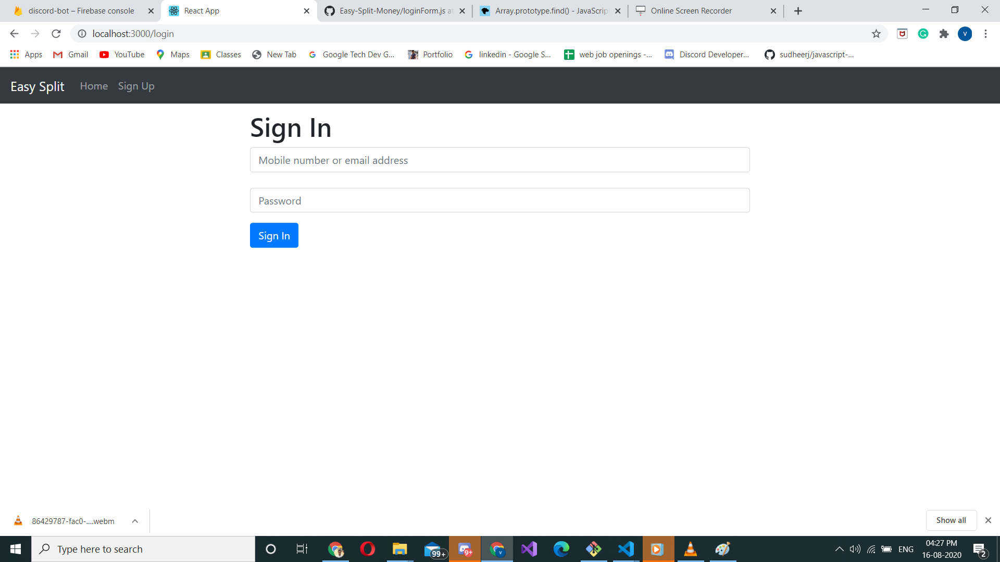

# Easy-Split-Money

front end of Easy-split-money App

technology used : HTML,CSS, React.JS

For Backend : Node.js and Express.js

Back-End gitHub link: https://github.com/vikram1995/splitwise-backend

Welcome page : Has two button signIn and signUp

SignUp Form : Has password match check and no duplicate user check

------

Login page: 

Dashboard : 

Add Friend : 

Add Expense : 

SettelUp : 

